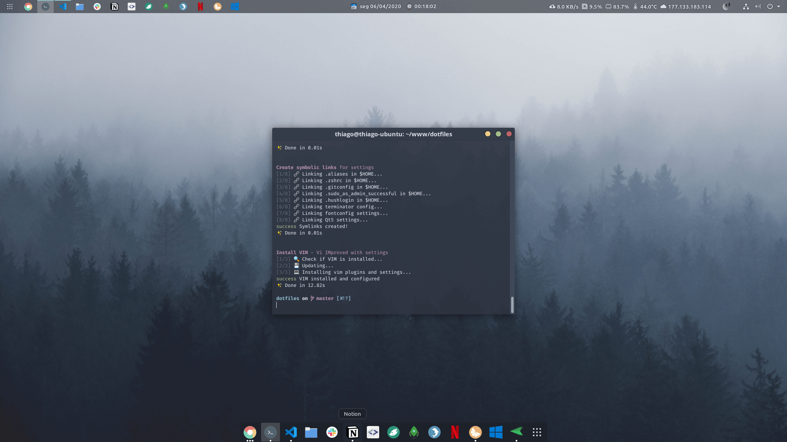
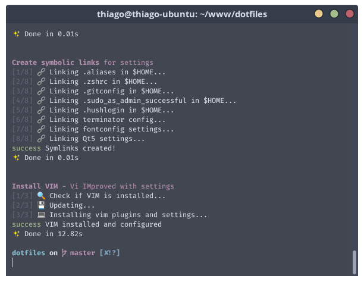
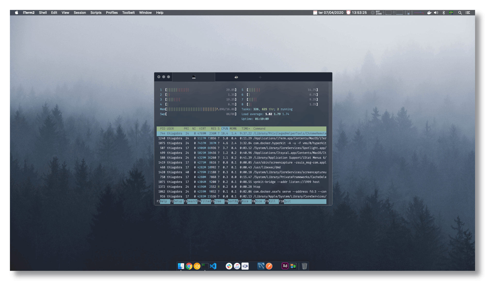

<p align="center">
  
</p>

<h1 align="center">dotbraga</h1>

<p align="center">
  <a href="https://github.com/thiagobraga">@thiagobraga's</a> dotfiles<br>
  <a href="https://raw.githubusercontent.com/thiagobraga/todoist-userstyles/master/theme.user.css"></a>
  <a href="https://www.paypal.com/cgi-bin/webscr?cmd=_donations&business=thibraga06%40gmail.com&item_name=Contribuir+para+o+desenvolvimento+de+projetos+open+source&currency_code=BRL&source=url" target="_blank" rel="nofollow noopener"></a>
</p>

<p align="center">
  
</p>

## Features

- Install [Oh My ZSH](https://ohmyz.sh)
  * [Spaceship](https://denysdovhan.com/spaceship-prompt) theme
  * [zsh-syntax-highlighting](https://github.com/zsh-users/zsh-syntax-highlighting) plugin
  * [zsh-autosuggestions](https://github.com/zsh-users/zsh-autosuggestions) plugin
- Install [VIM - Vi IMproved](https://www.vim.org) with settings
- Symlinks for [.aliases](./.aliases), [.zshrc](./.zshrc) and more
- Symlink settings for [Terminator](https://gnometerminator.blogspot.com/p/introduction.html), [Clementine](https://www.clementine-player.org/pt_BR/) and more
- Shortcut "Restart to Windows" for Dual Boot systems

## Installation

``` sh
git clone https://github.com/thiagobraga/dotfiles
cd dotfiles
./install
```



## More screenshots

### Mac OS

<p align="center">
   
</p>

## Shortcuts

### Terminator

- Copy: <kbd>Ctrl</kbd> + <kbd>C</kbd>
- Paste: <kbd>Ctrl</kbd> + <kbd>V</kbd>
- New tab: <kbd>Ctrl</kbd> + <kbd>T</kbd>
- Close tab: <kbd>Ctrl</kbd> + <kbd>W</kbd>
- Split vertically: <kbd>Ctrl</kbd> + <kbd>Shift</kbd> + <kbd>D</kbd>
- Split horizontally: <kbd>Ctrl</kbd> + <kbd>D</kbd>

## TODO

- [x] 🐛 Docs: Reduce image sizes
- [ ] ✨ Global: Install Fira Code font
- [ ] ✨ Ubuntu: Install Gnome extensions
- [ ] ✨ Ubuntu: Configure Gnome extensions
- [ ] ✨ Ubuntu: Configure Gnome behavior
- [ ] ✨ Ubuntu: Version Gnome Keyboard Shortcuts
  - Added <kbd>Alt</kbd> + <kbd>Shift</kbd> + <kbd>E</kbd> for open Emoji Keyboard shortcut Chrome extension (exported as app)
- [ ] ✨ Ubuntu: Install and configure Noto Emoji
- [ ] ✨ KDE: Version desktop settings
- [ ] ⚙ Vim: Create method to compile vim as below 

### Temp

- Compile `vim`:

``` bash
VIM_PREFIX="$HOME"/www/oss/bin/vim

./configure \
  --enable-256-color \
  --enable-cscope \
  --enable-gtk2-check \
  --enable-gui=auto \
  --enable-luainterp \
  --enable-multibyte \
  --enable-perlinterp \
  --enable-python3interp \
  --enable-rubyinterp \
  --with-compiledby="j.jith" \
  --with-features=huge \
  --with-python3-config-dir=/usr/lib/python3.7/config-3.7m-x86_64-linux-gnu \
  --with-x \
  --prefix=${VIM_PREFIX}

sudo sh -c "
  update-alternatives --install /usr/bin/editor editor ${VIM_PREFIX}/bin/vim 1;
  update-alternatives --set editor ${VIM_PREFIX}/bin/vim;
  update-alternatives --install /usr/bin/vim vim ${VIM_PREFIX}/bin/vim 1;
  update-alternatives --set vim ${VIM_PREFIX}/bin/vim;
  update-alternatives --install /usr/bin/vi vi ${VIM_PREFIX}/bin/vim 1;
  update-alternatives --set vi ${VIM_PREFIX}/bin/vim;
  update-alternatives --install /usr/bin/gvim gvim ${VIM_PREFIX}/bin/gvim 1;
  update-alternatives --set gvim ${VIM_PREFIX}/bin/gvim
"
```

- Previous wallpapers  
🖥️ https://i.imgur.com/0K0LqAI.png  
🖥️ http://wallpaperswide.com/ghost_nebula-wallpapers.html
