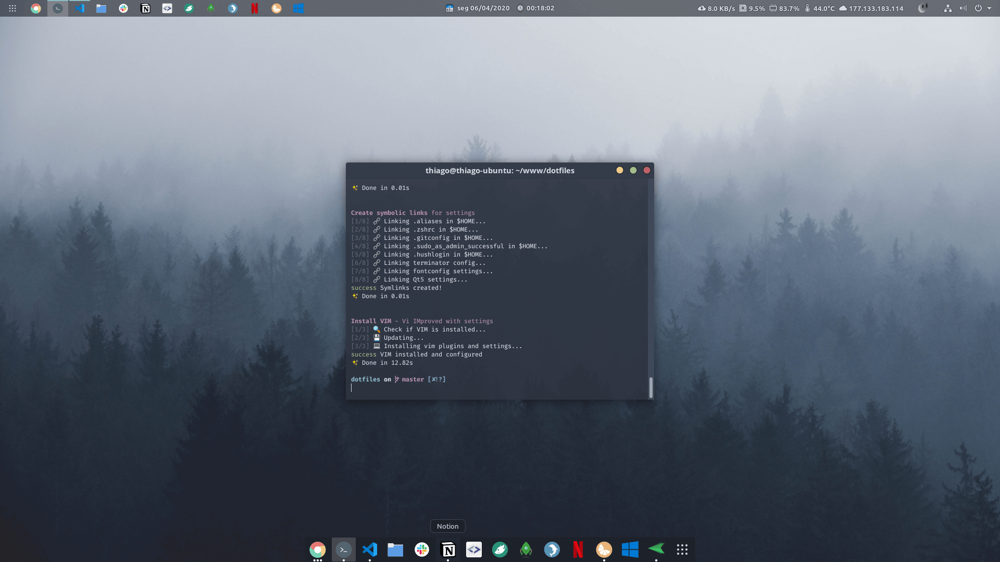
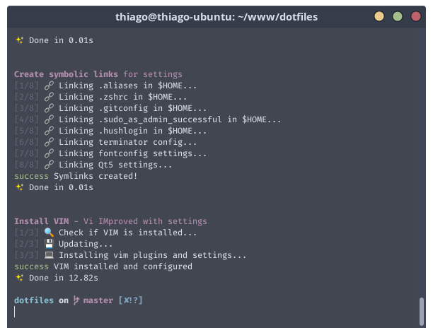

<p align="center">
  
</p>

<h1 align="center">dotbraga</h1>

<p align="center">
  <a href="https://github.com/thiagobraga">@thiagobraga's</a> dotfiles<br>
  <a href="https://raw.githubusercontent.com/thiagobraga/todoist-userstyles/master/theme.user.css"></a>
  <a href="https://www.paypal.com/cgi-bin/webscr?cmd=_donations&business=thibraga06%40gmail.com&item_name=Contribute+to+development+of+open+source+projects&currency_code=USD&source=url" target="_blank" rel="nofollow noopener"></a>
</p>

<p align="center">
  <b><a href="#features">Features</a></b> • 
  <b><a href="#installation">Installation</a></b> • 
  <b><a href="#docs">Docs</a></b> • 
  <b><a href="#screenshots">Screenshots</a></b>
</p>

<p align="center">
  
</p>

## Features

<br>

### [Oh My ZSH](https://ohmyz.sh)  
<sup>✨ [Spaceship Theme](https://denysdovhan.com/spaceship-prompt)</sup>  
<sup>✨ [zsh-autosuggestions](https://github.com/zsh-users/zsh-autosuggestions)</sup>  
<sup>✨ [zsh-syntax-highlighting](https://github.com/zsh-users/zsh-syntax-highlighting)</sup>  
<br>
### [VIM · Vi IMproved](https://www.vim.org)  
<sup>✨ [CtrlP](https://kien.github.io/ctrlp.vim)</sup>  
<sup>✨ [NERDtree](https://github.com/preservim/nerdtree)</sup>  
<sup>✨ [vim-airline](https://github.com/vim-airline/vim-airline)</sup>  
<sup>💻 _One Dark theme [wip]_</sup>  
<sup>💻 _Compiled from latest version on Github [wip]_</sup>  
<br>
### [Fira Code]()  
<sup>For beautiful coding and font ligatures</sup>  
<sup>💻 _Automatic install via script [wip]_</sup>  
<br>
### [Aliases](./docs/aliases.md)  
<sup>Many of them inspired on Oh My ZSH aliases</sup>  
<sup>✨ [git](./docs/aliases.md#git)</sup>  
<sup>✨ [docker](./docs/aliases.md#docker)</sup>  
<sup>✨ [docker-compose](./docs/aliases.md#docker-compose)</sup>  
<sup>✨ [yarn](./docs/aliases.md#yarn)</sup>  
<sup>✨ [apt](./docs/aliases.md#apt)</sup>  
<br>
### [Terminator](./docs/terminator.md)  
<sup>✨ Beautiful semi-transparent [Nord](https://www.nordtheme.com) theme. See [**screenshots**](#screenshots) 📷</sup>  
<sup>✨ [Improved keyboard shortcuts](./docs/terminator.md#color-palette)</sup>

### ["Restart to Windows" shortcut](./src/dual-boot/windows.sh)
<sup>Automates the restart process for Dual Boot systems</sup>  
<sup>✨ Detects the Windows ID on GRUB list</sup>  
<sup>✨ Restart system to that detected OS</sup>  
<sup>✨ Shows confirmation dialog using Zenity from Ubuntu [option]</sup>

<br>

## Installation

<br>

``` sh
git clone https://github.com/thiagobraga/dotbraga
cd dotbraga
./install
```

The install script accepts some params. Here's a overview of the usage:

``` sh
./install           # Install everything
./install --all     # Install everything
./install ohmyzsh   # Install only Oh My ZSH
./install vimrc     # Install Vim and its settings
```

See the [install](./install) script to see all the possibilities. You can hit `./install -h` or `./install --help` to get help from the script.

<br>

## Docs

<br>

- [**Aliases**](./docs/aliases.md)
- [**Terminator**](./docs/terminator.md)
- [**ViM**](./docs/vim.md)

<br>

## Screenshots

<br>


