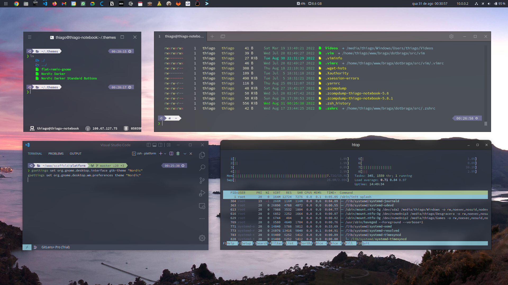
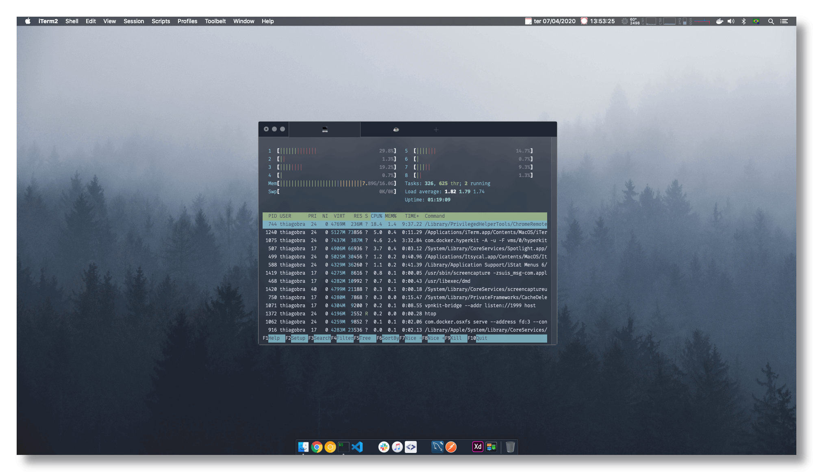

<p align="center">
  
</p>

<h1 align="center">dotbraga</h1>

<p align="center">
  <a href="https://github.com/thiagobraga">@thiagobraga's</a> dotfiles<br>
  <a href="https://raw.githubusercontent.com/thiagobraga/todoist-userstyles/master/theme.user.css"></a>
</p>

<p align="center">
  <b><a href="#features">Features</a></b> ·
  <b><a href="#installation">Installation</a></b> ·
  <b><a href="#docs">Docs</a></b> ·
  <b><a href="#screenshots">Screenshots</a></b>
</p>

<p align="center">
  
</p>

<br>

## Features

<br>

### [Oh My Zsh](https://ohmyz.sh)  

✨ [zsh-autosuggestions](https://github.com/zsh-users/zsh-autosuggestions)  
✨ [zsh-syntax-highlighting](https://github.com/zsh-users/zsh-syntax-highlighting)  
~~✨ [Spaceship Theme](https://denysdovhan.com/spaceship-prompt)~~  
✨ Powerlevel10k  

<br>

### [VIM · Vi IMproved](https://www.vim.org)  

✨ [CtrlP](https://kien.github.io/ctrlp.vim)  
✨ [NERDtree](https://github.com/preservim/nerdtree)  
✨ [vim-airline](https://github.com/vim-airline/vim-airline)  
💻 _One Dark theme [wip]_  
💻 _Compiled from latest version on Github [wip]_  

<br>

### [Aliases](./docs/aliases.md)  

Many of them inspired on Oh My Zsh aliases  
✨ [apt](./docs/aliases.md#apt)  
✨ [docker](./docs/aliases.md#docker)  
✨ [docker-compose](./docs/aliases.md#docker-compose)  
✨ [git](./docs/aliases.md#git)  
✨ [yarn](./docs/aliases.md#yarn)  

<br>

### [Terminator](./docs/terminator.md)  

✨ Beautiful semi-transparent [Nord](https://www.nordtheme.com) theme. See [**screenshots**](#screenshots) 📷  
✨ [Improved keyboard shortcuts](./docs/terminator.md#color-palette)

<br>

### ["Restart to Windows" shortcut](./src/dual-boot/windows.sh)

Automates the restart process for Dual Boot systems  
✨ Detects Windows on GRUB list  
✨ Restart system to that detected OS  

<br>

## Installation

<br>

``` sh
git clone https://github.com/thiagobraga/dotbraga
cd dotbraga
./install
```

The install script accepts some params. Here's a overview of the usage:

``` sh
./install           # Install everything
./install --all     # Install everything
./install ohmyzsh   # Install only Oh My Zsh
./install vimrc     # Install Vim and its settings
```

See the [install](./install) script to see all the possibilities. You can hit `./install -h` or `./install --help` to get help from the script.

<br>

## Docs

<br>

- [**Aliases**](./docs/aliases.md)
- [**Terminator**](./docs/terminator.md)
- [**ViM**](./docs/vim.md)

<br>

## Screenshots

<br>  





<!-- This project is tested with BrowserStack -->
